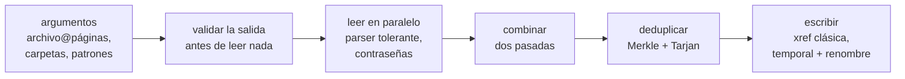
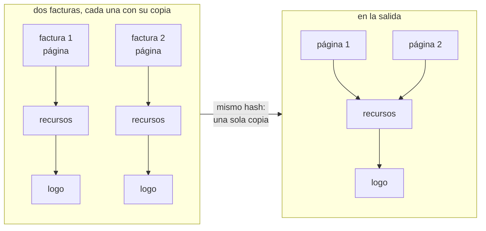

# pdf-merge

<p>
  <a href="https://github.com/agustinyarrus/pdf-merge/releases/latest"></a>
  
  
  
  <a href="LICENSE"></a>
</p>

Juntá varios PDF en uno desde la consola de Windows, en el orden que digas y con las páginas que elijas, sin subirlos a ningún lado. pdf-merge copia las páginas tal cual, conserva marcadores, enlaces y formularios, abre los PDF cifrados y guarda una sola vez lo que se repite entre archivos.

<p align="center">
  <picture>
    <source media="(prefers-reduced-motion: reduce)" srcset="demo/demo.png">
    
  </picture>
</p>
<p align="center"><sub>Una sesión real en una terminal de 100×30, grabada con <a href="https://github.com/charmbracelet/vhs">VHS</a> sobre PDF de prueba: 44 MB en 49 ms · <a href="demo/demo.webm">en video</a> · <a href="demo/demo.tape">el guion</a> · <a href="demo/LEEME.md">cómo regrabarla</a></sub></p>

<details>
<summary>¿Sin imágenes? La misma sesión, en texto</summary>

```text
> pdf-merge informe.pdf@1-4 escaneo.pdf@impares facturas -o legajo.pdf

  pdf-merge  ·  combina varios PDF en uno, local                                            v1.0.0


  ● 6 archivos   ● salida legajo.pdf

  ✓ informe.pdf@1-4   4 de 12 páginas · 10,6 KB
  ✓ facturas\factura-01.pdf   1 página · 187 KB
  ✓ facturas\factura-02.pdf   1 página · 187 KB
  ✓ facturas\factura-03.pdf   1 página · 187 KB
  ✓ facturas\factura-04.pdf   1 página · 187 KB
  ✓ escaneo.pdf@impares   8 de 16 páginas · 43,1 MB


     pdf-merge

     ● Archivos               6
     ● Páginas                16
     ● Entrada                43,8 MB
     ● Salida                 21,7 MB
     ● Repetidos fusionados   16 objetos · −554 KB
     ● Marcadores             8
     ● Archivo                legajo.pdf
     ● Tiempo                 49 ms
```

</details>

Un único `.exe` de unos 3 MB, en Go puro y con un lector y un escritor de PDF propios: sin instalador, sin dependencias, sin nube; los documentos no salen de la máquina. Antes vivía en navaja, una suite de herramientas de consola para Windows; ahora es un proyecto propio.

[Por qué](#por-qué) · [Instalar](#instalar) · [Uso](#uso) · [Recorrido](#recorrido) · [Cómo funciona](#cómo-funciona) · [Cómo se verificó](#cómo-se-verificó) · [Límites](#límites)

## Por qué

Juntar PDF es de las tareas que más se resuelven subiendo documentos a un sitio de "combinar PDF": contratos, facturas, escaneos, justo lo que no conviene mandar a un servidor ajeno. Hacerlo en la PC tiene sus vueltas, y pdf-merge las resuelve una por una:

- **Los PDF reales no son los del manual.** Tablas de referencias en stream, object streams, actualizaciones incrementales, basura antes del encabezado, desplazamientos que no apuntan donde dicen. Un lector estricto rechaza la mitad de lo que baja de un sistema de facturación.
- **Copiar no es rehacer.** Las páginas se copian tal cual, sin recomprimir ni rasterizar: la calidad es la del original.
- **Lo repetido pesa.** Diez facturas del mismo sistema traen diez veces el mismo logo y las mismas fuentes. pdf-merge los reconoce por contenido y guarda una sola copia.
- **Los nombres chocan.** Dos documentos pueden tener un destino de enlace o un campo de formulario con el mismo nombre; combinados sin cuidado, un enlace salta al archivo equivocado o dos campos comparten el valor.
- **Un "protegido" no siempre pide contraseña.** Muchos PDF están cifrados solo para restringir la impresión o la copia y se abren sin clave; los que la piden, la reciben con `--password`.

## Instalar

Bajá `pdf-merge.exe` de la [última release](https://github.com/agustinyarrus/pdf-merge/releases/latest) y copialo a una carpeta del `PATH`. Es el programa entero: Windows 10 u 11 de 64 bits (se probó en Windows 11), sin instalador. Al lado viene `SHA256SUMS` para comprobarlo:

```powershell
(Get-FileHash .\pdf-merge.exe -Algorithm SHA256).Hash -eq ((Get-Content .\SHA256SUMS) -split '\s+')[0]   # True
```

El `.exe` es reproducible: la misma etiqueta compilada con el mismo Go da los mismos bytes en cualquier máquina ([cómo](docs/RELEASE.md#5-el-exe-es-reproducible)).

Con [Go](https://go.dev/dl) 1.26 o más nuevo (con un Go 1.21+ más viejo, Go baja solo la versión que pide el `go.mod`):

```powershell
go install github.com/agustinyarrus/pdf-merge@latest
```

Desde el repo:

```powershell
.\build.ps1          # dist\pdf-merge.exe, con la versión, el commit y el SHA256
.\build.ps1 -Test    # antes, go vet y todas las pruebas
```

No tiene módulos externos: el lector, el escritor, el cifrado y la deduplicación son biblioteca estándar de Go y código propio.

## Uso

```powershell
pdf-merge a.pdf b.pdf c.pdf -o todo.pdf               # en ese orden
pdf-merge contrato.pdf@1-2 firmas.pdf -o firmado.pdf  # las dos primeras del contrato y las firmas
pdf-merge libro.pdf@impares -o impares.pdf            # también: pares, reverso, 8- (hasta el final)
pdf-merge escaneos\ -o legajo.pdf                     # una carpeta entera, en orden natural
pdf-merge protegido.pdf anexo.pdf --password clave    # un PDF que pide contraseña
```

La selección va pegada a cada archivo, después de una `@`: `1-3,5`, `8-`, `impares`, `pares`, `reverso`. Un archivo que se llama `factura@2026.pdf` se toma entero, no como selección.

El PDF sale en el orden de los argumentos (lo de una carpeta o un patrón, en orden natural). Los archivos se leen en paralelo y cada uno se tilda cuando termina, así que la lista de la consola puede salir en otro orden: en la demo, el escaneo de 43 MB queda último.

| Flag | Qué hace |
|---|---|
| `-o`, `--out ARCHIVO` | el PDF de salida (`merged.pdf`) |
| `-f`, `--force` | sobrescribir la salida si ya existe |
| `--no-dedupe` | no fusionar imágenes y fuentes repetidas entre archivos |
| `-b`, `--bookmarks auto\|files\|keep\|none` | marcadores: uno por archivo con los originales adentro (auto), solo por archivo, solo los originales o ninguno |
| `-r`, `--recursive` | entrar en subcarpetas |
| `--skip-errors` | seguir sin los PDF que no se puedan leer (por defecto, no se combina nada) |
| `-p`, `--password CLAVE` | una contraseña para los PDF cifrados; se repite, y se prueba cada una en cada archivo |
| `-j`, `--jobs N` | lecturas en paralelo (0 = una por CPU) |

Flags al estilo GNU (`-o x`, `--out=x`, `-rf`, `--`); un flag mal escrito sugiere el más parecido. Los patrones (`*`, `?`, `[]`, `**`) los expande pdf-merge, porque ni cmd ni PowerShell lo hacen para un programa nativo. Respeta `NO_COLOR` y `--no-color`; si la salida no es una consola, no emite ni un escape. Códigos de salida: `0` todo bien · `1` se combinó salteando PDF ilegibles (`--skip-errors`) · `2` línea de comandos inválida · `3` no se pudo combinar · `130` cancelado con Ctrl+C.

<details>
<summary><code>pdf-merge --help</code>, entera</summary>

```text
> pdf-merge --help

  pdf-merge  ·  combina varios PDF en uno, local                                            v1.0.0

  uso
    pdf-merge <archivo.pdf[@páginas]|carpeta|patrón>… [-o salida.pdf]
    pdf-merge a.pdf b.pdf c.pdf -o todo.pdf
    pdf-merge informe.pdf@1-3 anexo.pdf@5,8- -o recorte.pdf

  salida
    -o, --out ARCHIVO                PDF de salida (merged.pdf)
    -f, --force                      sobrescribir la salida si ya existe
        --no-dedupe                  no fusionar imágenes y fuentes repetidas entre archivos
    -b, --bookmarks auto|files|keep|none
                                     marcadores: uno por archivo con los originales adentro
                                     (auto), solo por archivo (files), solo los originales (keep)
                                     o ninguno (none) (auto)

  entrada
    -r, --recursive                  entrar en subcarpetas al pasar una carpeta
        --skip-errors                seguir sin los PDF que no se puedan leer (por defecto se
                                     aborta)
    -p, --password CLAVE             contraseña para abrir PDF cifrados (repetible; se prueba en
                                     cada uno)
    -j, --jobs N                     lecturas en paralelo (0 = una por CPU) (0)

  general
    -h, --help                       muestra esta ayuda
    -V, --version                    muestra la versión
        --no-color                   salida sin colores (también respeta NO_COLOR)

  ejemplos
    pdf-merge *.pdf -o todo.pdf                  todos los PDF de la carpeta, en orden natural
    pdf-merge contrato.pdf@1-2 firmas.pdf        las dos primeras del contrato y después las
                                                 firmas
    pdf-merge libro.pdf@impares -o impares.pdf   también: pares, reverso, 8- (hasta el final)
    pdf-merge escaneos/ -o legajo.pdf            una carpeta entera (orden natural: pag2 antes que
                                                 pag10)

  notas
    · Las páginas se copian tal cual: no se recomprime ni se pierde calidad.
    · Las imágenes y fuentes idénticas se guardan una sola vez aunque vengan de archivos distintos
      (típico al juntar facturas o catálogos del mismo sistema).
    · Los enlaces internos se conservan cuando apuntan a páginas incluidas.
    · Los PDF cifrados que se abren sin contraseña (solo restricciones) se combinan directo; los
      que piden una, con --password. La salida no va cifrada.
    · Si un nombre de archivo tiene '@' (factura@2026.pdf) se toma entero, no como selección.
```

</details>

## Recorrido

Todas las salidas de esta sección son reales: pdf-merge 1.0.0 en una consola de 100 columnas, sobre los PDF de prueba de la demo en una carpeta montada como `X:\docs\obra`, capturadas el 28/9/2026.

### Un PDF que pide contraseña

`contrato.pdf` está cifrado con AES-256 (revisión 6), con contraseña para abrirlo y restricciones de impresión, copia y edición. Con `-p` se abre y se combina: su línea dice que se descifró, y el aviso del pie, que las restricciones no pasan a la salida (que no va cifrada):

```text
> pdf-merge contrato.pdf informe.pdf@5- -o completo.pdf -p obra2026

  pdf-merge  ·  combina varios PDF en uno, local                                            v1.0.0


  ● 2 archivos   ● salida completo.pdf

  ✓ informe.pdf@5-   8 de 12 páginas · 10,6 KB
  ✓ contrato.pdf   12 páginas · 12,0 KB · descifrado


     pdf-merge

     ● Archivos               2                   ● Repetidos fusionados   3 objetos
     ● Páginas                20                  ● Marcadores             8
     ● Entrada                22,6 KB             ● Archivo                completo.pdf
     ● Salida                 16,5 KB             ● Tiempo                 5 ms

    ! 1 archivo tenía restricciones del propietario (imprimir, copiar, editar); la salida no las
      conserva
```

Sin la contraseña, no se combina nada y se dice por qué:

```text
> pdf-merge contrato.pdf informe.pdf -o x.pdf

  pdf-merge  ·  combina varios PDF en uno, local                                            v1.0.0


  ● 2 archivos   ● salida x.pdf

  ✓ informe.pdf   12 páginas · 10,6 KB
  ✗ contrato.pdf   pide contraseña para abrirse: pasala con --password

    ✗ No se combinó nada   1 archivo con error (usá --skip-errors para seguir sin ellos)
```

### Uno que no se puede leer

`roto.pdf` son los primeros 1.000 bytes de una factura. Por defecto, un PDF ilegible frena todo; con `--skip-errors`, se combina el resto y el código de salida es `1`, para que un script lo note:

```text
> pdf-merge informe.pdf roto.pdf -o todo.pdf

  pdf-merge  ·  combina varios PDF en uno, local                                            v1.0.0


  ● 2 archivos   ● salida todo.pdf

  ✓ informe.pdf   12 páginas · 10,6 KB
  ✗ roto.pdf   no encontré el catálogo del documento (/Type /Catalog)

    ✗ No se combinó nada   1 archivo con error (usá --skip-errors para seguir sin ellos)
```

```text
> pdf-merge informe.pdf roto.pdf -o todo.pdf --skip-errors

  pdf-merge  ·  combina varios PDF en uno, local                                            v1.0.0


  ● 2 archivos   ● salida todo.pdf

  ✓ informe.pdf   12 páginas · 10,6 KB
  ✗ roto.pdf   no encontré el catálogo del documento (/Type /Catalog)


     pdf-merge

     ● Archivos     1              ● Salida       10,0 KB        ● Tiempo       2 ms
     ● Páginas      12             ● Marcadores   4              ● Omitidos     1
     ● Entrada      10,6 KB        ● Archivo      todo.pdf
```

### Nunca pisa una entrada

La salida se valida antes de leer nada: no puede ser una de las entradas, ni un archivo que ya existe (sin `--force`).

```text
> pdf-merge informe.pdf escaneo.pdf -o informe.pdf

  pdf-merge  ·  combina varios PDF en uno, local                                            v1.0.0


  ✗ la salida informe.pdf es también una de las entradas: elegí otro nombre con -o
```

### Un flag mal escrito

```text
> pdf-merge informe.pdf --bookmark none

  ✗ no conozco --bookmark; ¿quisiste decir --bookmarks?
  › pdf-merge --help muestra todas las opciones
```

## Cómo funciona



### Leer

- **Un lexer descendente recursivo** sobre el archivo en memoria. Los números reales se reescriben con la representación más corta que vuelve exacta al mismo float64 (redondear a 6 decimales achicaba la negrita de Chrome, ver abajo).
- **Las referencias cruzadas**: tablas clásicas (leídas por tokens: se toleran filas de 19 o 21 bytes), xref streams con `/W`, `/Index` y predictores PNG/TIFF, object streams, la cadena `/Prev` de la más nueva a la más vieja y los xref híbridos con `/XRefStm`.
- **La recuperación**: si la tabla falla, se reconstruye barriendo el archivo por `N G obj`; si un objeto no está donde dice la tabla, la reconstrucción se hace una vez, al vuelo. El trailer se busca en el último `trailer`, en el xref stream más reciente o, a mano, por el catálogo.
- **El cifrado**, antes que nada (si el catálogo está en un object stream cifrado, sin la clave ni se lo encuentra): RC4 de 40 y 128 bits, AES-128 y AES-256, revisiones 2 a 6 del manejador estándar, con el algoritmo 2.B de ISO 32000-2 para la 6. Primero se prueba la contraseña vacía y después cada `--password`, como de usuario y como de propietario. En las revisiones 2 a 4 la contraseña va en PDFDocEncoding: una "ñ" es el byte `0xF1`, no los dos de UTF-8.

### Combinar

- **Un copiador por documento**: el mismo PDF pedido dos veces copia sus recursos una sola vez.
- **Barreras**: una referencia a una página que no se eligió pasa a `null`, y el árbol de páginas viejo y el catálogo de origen no se recorren. No se arrastran páginas huérfanas.
- **Dos pasadas**: primero se reservan los números de todas las páginas de salida y después se copia, así un enlace hacia adelante ya encuentra su destino.
- **Lo heredado se materializa**: `MediaBox`, `CropBox`, `Resources` y `Rotate` quedan escritos en cada página.
- **Marcadores**: el árbol de cada origen, con sus destinos remapeados a las páginas nuevas; se podan los que llevan a una página que quedó afuera y cada nivel lleva su `/Count` correcto.
- **Destinos con nombre**: se resuelven a destinos explícitos (tanto el `/Dests` de PDF 1.1 como el árbol `/Names`), así dos archivos con un destino del mismo nombre no chocan, y un enlace a una página que quedó afuera queda inerte en vez de roto.
- **Formularios**: entran los campos con algún widget en una página incluida; los nombres que chocan entre archivos se renombran (`fecha`, `fecha_2`) y se fusionan `/DR`, `/DA`, `/NeedAppearances` y `/SigFlags`. Si había firmas, avisa que dejan de validar; el `/XFA` se descarta, con aviso.

### Deduplicar: Merkle y Tarjan

Dos objetos son el mismo si su contenido es el mismo *y* apuntan a objetos que son el mismo. Eso es un hash de Merkle sobre el grafo de objetos: el hash de cada uno se calcula sobre su forma canónica (cada valor con su etiqueta de tipo, los largos prefijados, los diccionarios con las claves ordenadas), con cada referencia reemplazada por el hash del objeto apuntado.



Los dos logos tienen el mismo hash y quedan en uno; los dos diccionarios de recursos, que solo diferían en a qué logo apuntaban, pasan a tener el mismo hash y también quedan en uno. Las páginas no: cada una conserva su identidad.

Para calcular el hash de un padre hacen falta los de sus hijos, y un PDF puede tener ciclos (una página apunta a su árbol de páginas, que apunta a la página). Por eso el recorrido son las **componentes fuertemente conexas de Tarjan**, en versión iterativa: salen en orden topológico inverso, los hijos antes que los padres. Lo que está dentro de un ciclo, y las páginas, anotaciones, campos y capas, conservan su identidad: reciben un hash que ningún contenido puede producir y nunca se fusionan. Al final se marca lo alcanzable desde el catálogo y se renumera. Todo es O(V + E), más el hash de los bytes.

### Escribir

Una tabla xref clásica (la forma más compatible), `/Length` siempre directo e igual a los bytes escritos, y las claves ordenadas: la misma entrada da la misma salida. La salida va a un temporal en la misma carpeta y se renombra al final: un corte o un Ctrl+C nunca deja un PDF a medias ni pisa el anterior.

Más detalle: [docs/ARQUITECTURA.md](docs/ARQUITECTURA.md). Para mirar lo que ve el parser en un archivo: `go run ./internal/pdf/_dbg/dbg.go archivo.pdf`.

## Cómo se verificó

La regla: pdf-merge no se contrasta consigo misma, porque un parser que lee lo que escribió su propio escritor no prueba nada. Cada PDF combinado pasa por tres lectores independientes ([`verify.py`](internal/pdf/_oracle/verify.py)):

- **qpdf** (vía pikepdf): la estructura, con el chequeo estricto; cuentan solo las advertencias nuevas, no las que ya traía el origen.
- **pypdf**: la cantidad de páginas y el texto de cada una, en orden.
- **PDFium**, el motor de Chrome (vía pypdfium2): cada página combinada, renderizada y comparada píxel a píxel con su original.

| Etapa | Resultado |
|---|---|
| rangos, reverso, object streams y una página con imagen | qpdf sin advertencias nuevas, el texto en orden, 0 píxeles distintos |
| marcadores y enlaces, con destinos con nombre en todas sus formas | 6 de 6 casos |
| cifrado: revisiones 2 a 6, contraseña de usuario y de propietario, object streams cifrados | 13 de 13 casos |
| formularios: nombres únicos, sin widgets huérfanos, cada campo con su valor | 12 de 12 campos (un corpus armado de 10 PDF) |
| barrido de 56 PDF reales (Chrome en varias versiones, iTextSharp, SAP NetWeaver, reportlab…) | 56 de 56; todos juntos, 352 páginas en unos 2 s, y de 94,6 MB a 21,8 MB |
| el `legajo.pdf` de la demo | estructura válida, 16 páginas con su texto en orden, 0 píxeles distintos |

Los oráculos encontraron seis defectos que las pruebas internas no veían: números reales redondeados que achicaban un 0,06 % la negrita de las fuentes Type 3 de Chrome, el predictor PNG de los xref streams, `/Length` indirectos, basura antes del `%PDF-`, contraseñas en PDFDocEncoding y advertencias heredadas del origen contadas como propias.

- **61 pruebas de Go** (`go test ./...`), con el parser, la selección de páginas, la combinación, la deduplicación y las componentes de Tarjan. Siete leen PDF de prueba que genera [`scripts/fixtures.ps1`](scripts/fixtures.ps1); sin ellos, se saltean y lo dicen.
- **CI en `windows-latest`** con el Go mínimo del `go.mod` ([`ci.yml`](.github/workflows/ci.yml)): formato, `go vet` (también para Linux), los PDF de prueba y todas las pruebas sin salteadas, el `.exe` con su versión y su SHA256, y [`all.ps1`](internal/pdf/_oracle/all.ps1) con las etapas de casos armados. El barrido de PDF reales no corre ahí: son documentos privados y no viajan con el repo (se corrió cuando pdf-merge vivía en la suite; `all.ps1 -Corpus` lo repite con los propios).

El detalle y cómo correr todo con un comando: [docs/VERIFICACION.md](docs/VERIFICACION.md).

## Límites

- **Lo que se pierde al combinar**: la numeración de páginas propia de cada archivo (`/PageLabels`: la salida numera de corrido), las capas (`/OCProperties`) y la estructura de accesibilidad de un PDF etiquetado (`/StructTreeRoot`).
- **La salida no va cifrada** ni conserva las restricciones del propietario, y una firma digital deja de validar. Cada archivo descifrado sale marcado así, y las restricciones y las firmas que se pierden, con un aviso.
- **La salida usa una tabla xref clásica**, sin object streams: es lo más compatible, no lo más chico.
- Se compila y se prueba para `windows/amd64`. El lector y el escritor compilan en cualquier sistema (la CI corre `go vet` para Linux), pero pdf-merge está pensada y probada para Windows.

Lo que falta, en orden: [docs/PENDIENTE.md](docs/PENDIENTE.md).

## Estructura

```
main.go               abre la consola y llama a pdfmerge.Main
internal/
  pdfmerge/           la herramienta: flags, archivo@páginas, lectura en paralelo, tarjeta y avisos
  pdf/                lexer, parser tolerante, xref y object streams, cifrado, combinación,
                      deduplicación, marcadores, destinos con nombre, formularios, escritor
    _oracle/          verify.py (qpdf + pypdf + PDFium) y los guiones de cada etapa; all.ps1 corre todo
    _dbg/             muestra el xref y el trailer que ve el parser
  batch/              tareas en paralelo con barra viva y resultados en orden
  fsx/                patrones con **, orden natural, escritura atómica
  cli/                flags estilo GNU, ayuda, "¿quisiste decir…?"
  tui/                consola: paleta, región viva, tarjetas, formato es-AR
  textdist/           distancia de Damerau–Levenshtein
  win/desk/           modo y tamaño de la consola, por syscall
  version/            versión y commit, estampados por build.ps1
scripts/              fixtures.ps1 y fixtures_pdf.py: los PDF de prueba
demo/                 la grabación del README, su guion de VHS y el generador de sus PDF
docs/                 arquitectura, verificación, pendientes y cómo se arma una release
.github/              la CI: formato, vet, pruebas, oráculos y el .exe con su SHA256
build.ps1             compila dist\pdf-merge.exe con la versión y el commit (-Test: antes, vet y pruebas)
```

## Licencia

[MIT](LICENSE).
